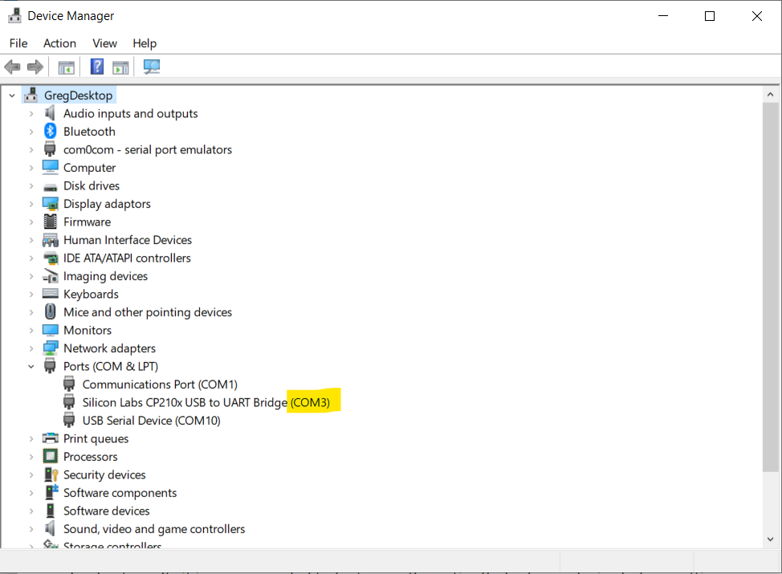
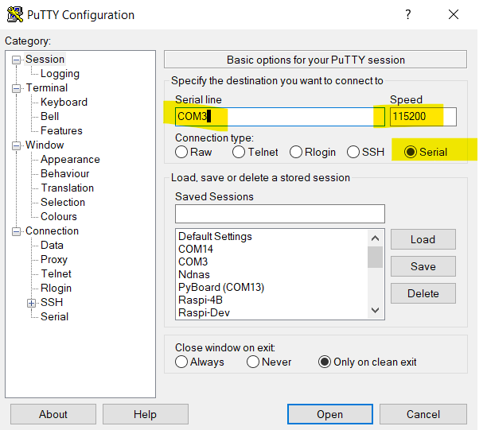

* ToDO: Add header image with board and micropython logo

This is a little diversion from Rust on the STM32. My nephew has been doing some Python at school, and also had a project in mind for an ESP8266/ESP32. I had a couple of spares, so it's time to flash MicroPython onto them and have a play.

It is worth noting that using microPython on a board like the ESP32 is not a well polished experience. It may be worth going for a more expensive board that was built with microPython in mind, or going for the even more polished [CircuitPython](https://learn.adafruit.com/welcome-to-circuitpython/what-is-circuitpython).


## Setting up your host PC 

* **Essential:** Install [Python 3.x 64bit Windows](https://www.python.org/downloads/windows/) - you're host PC uses various Python tools to flash microPython to the board, upload your code, and perform other tasks
  * [Use the Windows Installer Version](https://www.python.org/downloads/)
  * [Don't use the Windows Store version](https://docs.python.org/3/using/windows.html#:~:text=The%20full%20installer%20contains%20all,IDLE%20or%20other%20development%20environments.)
  * I left everything default except...
  * Add Python 3.8 to PATH: Yes
  * Note: I did not use the Customize Installation option, which can be used to install Python in C:\Program Files, as this can cause extra permissions problems when running pip from a non-elevated command prompt.

* **Recommended:** Install [Putty](https://www.chiark.greenend.org.uk/~sgtatham/putty/latest.html). You need a way to communicate with serial ports. Putty is one way to do it, and is commonly used for a variety of tasks, so it is worth getting used to its quirky UI.  Use the 64bit MSI ("Windows Installer")
* **Recommended:** Install [Visual Studio Code](https://code.visualstudio.com/) Because you don't want to be writing code in the REPL, or Notepad!
* **Recommended** Install [Windows Terminal](https://aka.ms/terminal). Because it is a lot more user friendly than the 30 year old Command Prompt.
* **Optional:** Python Virtual Environments are very useful, as they allow you to create independent environments for different projects, each with their own sets of packages. Read about [Virtual Environments here](https://docs.python.org/3/tutorial/venv.html). I'll be using venv in this tutorial.


## Flash MicroPython onto the ESP32 

* [Download the ESP32 firmware](https://micropython.org/download/esp32/). I used the latest **stable** one based on **ESP-IDF v3.x**, and save or copy it to your working folder.
  * Note: by using the stable version of MicroPython, we don't need the extra step of "disabling debug output"
* Find the COM port of your ESP32
  * Open Device Manager (right click the Windows Logo and choose Device Manager)
  * Expand **Ports (COM & LPT)**
  * Plug in you ESP32. You should see a new COM port appear, and then disappear when you remove it. Make a note of the COM port, e.g. COM3
    
* Erase the deviceh, then upload new firmware (change COM port number as appropriate)
    * Hold down the **Boot** button on the ESP32 board as you hit *Enter* on the following command, and keep it pressed until you see something useful happening. This may or may not be needed for the next step as well.

```dos
esptool.py --port COM3 erase_flash```
esptool.py --chip esp32 --port COM3 write_flash -z 0x1000 esp32-idf3-20191220-v1.12.bin
```

* If the above commands run without error then MicroPython should be installed on your board!

Reference (and additonal info if things go wrong): [Getting started with MicroPython on the ESP32](https://docs.micropython.org/en/latest/esp32/tutorial/intro.html)

## Using Putty to Connect to the REPL Prompt

After initial setup, the only way to get a REPL prompt is over a serial port. This is where **Putty** comes in. Putty can be used for various types of connection to remote devices and servers, but we are just interested in the simple case of a **Serial** connection.
1. Select the **Serial** radio button
1. Change **Serial line** to that used by your ESP32 board. Mine was COM3
1. Change the Speed (also known as baud rate) to 115200
1. Optional: You can give these setting a name (in **Saved Sessions**), and **Save** it for future use



Once connected you should get a REPL prompt in your Putty session. 

You can mess around in REPL getting WiFi to work, and this is good for testing stuff out, but you're going to want those WiFi settings to run when the board starts up, so for this you need to write a **boot.py** and be able to upload it.

The tutorial at [docs.micropython.org](https://docs.micropython.org/en/latest/esp8266) are excellent. From this point I would skip straight to [tutorial/network_basics](https://docs.micropython.org/en/latest/esp8266/tutorial/network_basics.html) to learn how to do stuff with Wifi. They do everything in REPL, but if you want something to happen at every boot of the device, you should add it to **boot.py**

NEXT: Setting up your dev environment and writing some code

## Other References

* [Micropython, ESP8266 and VSCode](https://www.agilepartner.net/en/micropython-esp8266-and-vscode/)
* [Getting a MicroPython REPL prompt - official docs](https://docs.micropython.org/en/latest/esp8266/tutorial/repl.html)
* [Running MicroPython on the ESP8266 - a useful guide](https://pythonforundergradengineers.com/upload-py-files-to-esp8266-running-micropython.html)


