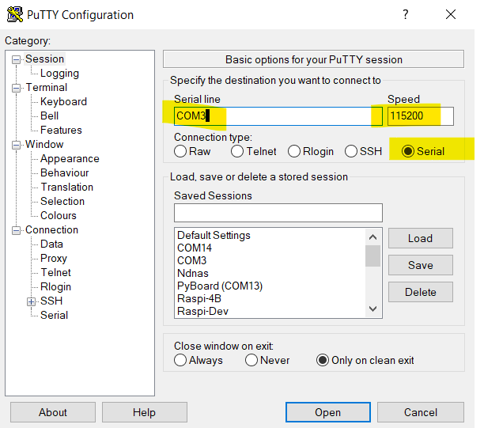

> **UPDATE:** I would not advise following this blog post at the moment. It is very much a work in progress. I am still trying to figure out the best way to get a reliable, easy to use development environment set up.


* Notes: WORK IN PROGRESS: tidy up later
* ToDO: Add header image with board and micropython logo


This is a little diversion from Rust on the STM32. My nephew has been doing some Python at school, and also had a project in mind for an ESP8266/ESP32. I had a couple of spares, so it's time to flash MicroPython onto them and have a play.

It is worth noting that developing using microPython on a board like the ESP32 is not a well polished experience. It may be worth going for a more expensive board that was built with microPython in mind, or going for the even more polished [CircuitPython](https://learn.adafruit.com/welcome-to-circuitpython/what-is-circuitpython).


## Setting up your host PC 

* **Essential:** Install [Python 3.x 64bit Windows](https://www.python.org/downloads/windows/) - you're host PC uses various Python tools to flash microPython to the board, upload your code, and perform other tasks
* **Recommended:** Install [Putty](https://www.chiark.greenend.org.uk/~sgtatham/putty/latest.html). You need a way to communicate with serial ports. Putty is one way to do it, and is commonly used for a variety of tasks, so it is worth getting used to its quirky UI.  Use the 64bit MSI ("Windows Installer")
* **Recommended:** Install [Visual Studio Code](https://code.visualstudio.com/) Because you don't want to be writing code in the REPL, or Notepad!
* **Recommended** Install [Windows Terminal](https://aka.ms/terminal). Because it is a lot more user friendly than the 30 year old Command Prompt.
* **Optional:** Python Virtual Environments are very useful, as they allow you to create independent environments for different projects, each with their own sets of packages. Read about [Virtual Environments here](https://docs.python.org/3/tutorial/venv.html). I'll be using venv in this tutorial.

## Be Organised!

Don't just dump your code anywhere, make a decision about where to put it! For me, this is **C:\Users\Gregw\MicroPython**

From Windows Terminal, or Command Prompt

* Set up folder structure. Adjust to taste! Don't forget the tab key to autocomplete partial folder and file names.

```dos
cd \Users\gregw\
mkdir micropython
cd micropython
```

* [Optional] Start a python virtual environment

```dos
python -m venv esp32-blinky
esp32-blinky\Scripts\activate.bat
```
* or, simply make a directory without a venv

```dos
mkdir esp32-blinky
```

Install some essential python tools: esptool, ampy amd rshell. These are needed either as standalone command line tools, or used as part of VS Code's  MicroPython IDE plugin.

```dos
pip install esptool adafruit-ampy rshell mpfshell-lite
```

## Open the new folder in VS Code

```dos
code esp32-blinky
```

You can now use the terminal built into VS-Code ```Ctrl+'```, if you like! 

## Getting MicroPython on the ESP32

* [Download the ESP32 firmware](https://micropython.org/download/esp32/). I used the latest **stable** one based on **ESP-IDF v3.x**, and save or copy it to your working folder. I copied it to: 'C:\users\gregw\micropython'
* Find the COM port of your ESP32
  * Open Device Manager (right click the Windows Logo and choose Device Manager)
  * Expand **Ports (COM & LPT)**
  * Plug in you ESP32. You should see a new COM port appear, and then disappear when you remove it. Make a note of the COM port, e.g. COM3
    
* Erase the flash (change COM port number as appropriate)
    * Hold down the **Boot** button on the ESP32 board as you hit *Enter* on the following command, and keep it pressed until you see something useful happening. This may or may not be needed for the next step as well.

```esptool.py --port COM3 erase_flash```

* Deploy the firmware (change COM port number and filename as appropriate)

```esptool.py --chip esp32 --port COM3 write_flash -z 0x1000 esp32-idf3-20191220-v1.12.bin```

  * Note: by using the stable version of MicroPython, we don't need the extra step of "disabling debug output"
* If the above commands run without error then MicroPython should be installed on your board!

Reference (and additonal info if things go wrong): [Getting started with MicroPython on the ESP32](https://docs.micropython.org/en/latest/esp32/tutorial/intro.html)

## Using it

After initial setup, the only way to get a REPL prompt is over a serial port. This is where **Putty** comes in. Putty can be used for various types of connection to remote devices and servers, but we are just interested in the simple case of a **Serial** connection.
1. Select the **Serial** radio button
1. Change **Serial line** to that used by your ESP32 board. Mine was COM3
1. Change the Speed (also known as baud rate) to 115200
1. Optional: You can give these setting a name (in **Saved Sessions**), and **Save** it for future use



Once connected you should get a REPL prompt in your Putty session. 

You can mess around in REPL getting WiFi to work, and this is good for testing stuff out, but you're going to want those WiFi settings to run when the board starts up, so for this you need to write a **boot.py** and be able to upload it.

The tutorial at [docs.micropython.org](https://docs.micropython.org/en/latest/esp8266) are excellent. From this point I would skip straight to [tutorial/network_basics](https://docs.micropython.org/en/latest/esp8266/tutorial/network_basics.html) to learn how to do stuff with Wifi. They do everything in REPL, but if you want something to happen at every boot of the device, you should add it to **boot.py**


To list, upload or download files - use **ampy**

## Try out ampy

> **Note:** that if you open a **new** command prompt, or a **new** terminal in VS Code, the following python commands will not work if you initially used a python virtual environment. In this case you need to 'activate' that venv again with ```scripts\activate.bat``` in your project folder.

> **Error**. If you get the following error: ```ampy. pyboard. ... PyboardError: could not enter raw repl```, it means your board is running a script rather than the REPL prompt. Press the boot button, and try again.


## List, Download and Upload Files

I recommend making sure you can connect to the **REPL** prompt with **Putty** before running the following commands. If ampy can't connect to the REPL, it tends to just hang forever.

```python
ampy --port COM3 --baud 115200 ls
ampy --port COM3 --baud 115200 get boot.py
ampy --port COM3 --baud 115200 put boot.py
```

When you "get" a file, it is output to the console. To turn this into a local file, you will need to "pipe" it to a file

```python
ampy --port COM3 --baud 115200 get boot.py > boot.py
```

The initial boot.py (note: it is all commented out)

```python
# This file is executed on every boot (including wake-boot from deepsleep)
#import esp
#esp.osdebug(None)
#import webrepl
#webrepl.start()
```

uncomment the last 4 lines, and reupload, or just run them one-by-one in the REPL prompt, to enable webREPL.

## WiFi: Connecting the ESP32 to your router

Here is a sample boot.py to connect to your home WiFi. You will need to change the SSID and password before uploading

```python
def do_connect():
    import network
    sta_if = network.WLAN(network.STA_IF)
    if not sta_if.isconnected():
        print('connecting to network...')
        sta_if.active(True)
        sta_if.connect('<essid>', '<password>')
        while not sta_if.isconnected():
            pass
    print('network config:', sta_if.ifconfig())

do_connect()
```
```

The commented out code allows you to start a WebREPL session. I find WebREPL more useful than ampy for uploading and downloading files. But eventually, we will attempt to get a slick plugin for VS Code which takes some of the pain out of uploading new files.


## Try out rshell

```python
rshell
``` 

Nothing much seems to happen, but your command prompt has changed colour. You can now run rshell commands, e.g.

```
help
help [command]
connect serial com3
```

## rshell connect DOESN'T WORK! INVESTIGATE!


## References

* [**READ THIS NEXT!** VS Code and PyMakr](https://lemariva.com/blog/2018/12/micropython-visual-studio-code-as-ide)
* [Micropython, ESP8266 and VSCode](https://www.agilepartner.net/en/micropython-esp8266-and-vscode/)
* [VS Code, more autocomplete info](https://lemariva.com/blog/2019/08/micropython-vsc-ide-intellisense)
* [Installing ampy](https://learn.adafruit.com/micropython-basics-load-files-and-run-code/install-ampy)
* [Getting a MicroPython REPL prompt - official docs](https://docs.micropython.org/en/latest/esp8266/tutorial/repl.html)
* [Running MicroPython on the ESP8266 - a useful guide](https://pythonforundergradengineers.com/upload-py-files-to-esp8266-running-micropython.html)


## Controlling the Onboard Display


